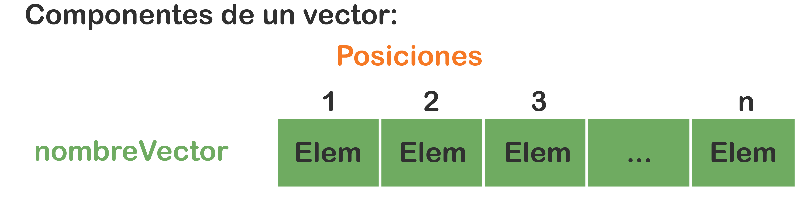
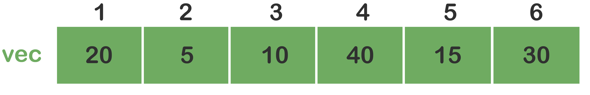
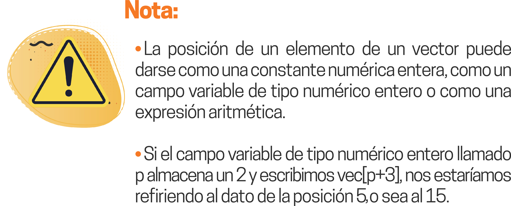

# Arreglos unidimensionales

1

Un arreglo es un área en la memoria que almacena un grupo de datos (estos pueden ser: o primitivos o tipos de datos definidos por el programador), pero deben ser homogéneos, es decir, del mismo tipo (primitivos del mismo tipo u objetos del mismo tipo). Todo arreglo es una estructura de datos de almacenamiento temporal de información (o sea, sus datos solo permanecen mientras que el programa esté en ejecución); los arreglos se utilizan bajo un manejo estático de memoria, lo cual conlleva que antes de utilizar un arreglo se debe reservar con anterioridad el área que este va a ocupar. Aun así, se corre el riesgo de reservar un área mayor o menor a la necesitada, lo cual implica que la cantidad de memoria reservada no puede cambiar en tiempo de ejecución, esto quiere decir que se establece en tiempo de compilación.

Existen arreglos unidimensionales y multidimensionales, los primeros (una dimensión) son conocidos como listas o vectores. Dentro de los segundos están los bidimensionales (dos dimensiones), conocidos como tablas o matrices. Los arreglos de 3 dimensiones o más son de poca utilización debido a que requieren de mucha memoria para su uso.

En este recurso veremos los arreglos unidimensionales.

## Vectores
Un vector es una estructura de datos en la que se almacena un conjunto homogéneo de datos. Debe tener un nombre nemotécnico para diferenciarlo de los demás vectores, cada dato es conocido también como elemento.

Dicho de otra forma, un vector es un área de almacenamiento de datos (elementos, ya sea, o primitivos o tipos de datos definidos por el programador) que está dividida en una serie de posiciones y en cada una de las cuales se almacenará un elemento. Cuando los elementos son tipos de datos primitivos, el arreglo almacena esos datos, pero cuando los elementos son tipos de datos definidos por el programador (objetos), el arreglo almacena las referencias a dichos objetos (las referencias son las direcciones en memoria donde están almacenados los objetos y se representan por valores hexadecimales).

### Componentes de un vector

- **nombreVector** : Se refiere al nombre del vector, debe ser nemotécnico y único en el programa.
- **Posiciones** : Son adyacentes (consecutivas) y en cada una se almacenará un elemento.
- **n** : Es el tamaño o longitud del vector.
- **Elem** : Es el elemento que se guarda en cada posición del vector (si el vector es de tipos de datos primitivos: es el dato; y si el vector es de datos definidos por el programador: es la referencia al objeto – dirección en memoria del objeto).

Los arreglos de una dimensión (vectores) se usan para representar datos que se pueden ver como una lista.

### Alusión a los datos de un vector
Cuando necesitemos referirnos a algún elemento de un vector, debemos escribir el nombre del vector seguido de un corchete y dentro de este un subíndice (constante, variable o expresión aritmética) que representa la posición de dicho elemento.

Suponga que el siguiente vector (de tipo de datos primitivo - entero) ya está almacenado en memoria:

Entonces, para hacer alusión al elemento 20 escribimos vec[1], al elemento 5 escribimos vec[2], etc.

De acuerdo con las siguientes asignaciones, ¿qué valor almacenaría cada campo variable?

x = vec[2] + vec[3] = 15  
k = vec[1] + vec[4] + 3 = 63  
z = (vec[1] - vec[2] + vec[6]) x 2 = 90  

### Operaciones con vectores
Las operaciones con vectores pueden ser: recorrido, búsqueda, inserción, borrado y ordenamiento.

#### Recorrido
El recorrido se refiere a visitar las posiciones del vector para hacer algo determinado con sus elementos, por ejemplo, cargar el vector en memoria (leerlo), mostrar sus datos (imprimirlo), hacer determinados cálculos con todos sus elementos o con algunos en particular, etc.

#### Busqueda
La búsqueda se refiere a hacerle un recorrido al vector para buscar un elemento determinado. Cuando la búsqueda concluya, se sabrá si dicho elemento existe o no en el vector y cuál es su posición. Luego, se podrá tomar una decisión dependiendo del resultado obtenido.  
Para programar una búsqueda se debe utilizar un ciclo Mientras, debido a que si el elemento existe en el vector se va a presentar una salida controlada de ciclo, es decir, cuando 10 encuentre se debe salir inmediatamente del ciclo.  

Existen varios métodos para buscar un dato en un vector, el primero (llamado secuencial) consiste en recorrer el vector visitando uno a uno sus datos hasta encontrar el dato buscado, si existe, o hasta que termine el vector si no existe. El segundo método es la búsqueda binaria, en donde el vector debe estar ordenado con anterioridad; se refiere a ir partiendo el vector primero por mitades, luego en cuartos, después en octavos y así sucesivamente hasta que concluya si el dato buscado existe o no.

#### Insercion
La inserción se refiere a ingresarle un nuevo elemento al vector después de que este ya esté cargado. EI ingreso del nuevo
elemento puede hacerse en cualquier posición del vector o en la posición $n+l$, lo implica una adición (meterse detrás del último). La inserción se da siempre y cuando exista espacio en el vector, por ejemplo, si se tiene reservada un área para 100 elementos (vector de 100 posiciones) y ya están ocupadas todas las posiciones, es imposible insertar uno nuevo en dicha área debido a que no hay espacio (posición) donde ponerlo.  

#### Borrado
El borrado, también conocido como eliminación, se refiere a eliminar físicamente un dato del vector, pero no la posición que este ocupa.

#### Ordenamiento
El ordenamiento se refiere a clasificar los datos de un vector en un orden determinado, ya sea ascendente o descendente. Cuando los elementos son numéricos, se ordenan de menor a mayor o de mayor a menor y, si son cadenas, se ordenan de la a hasta la z o de la z hasta la a (ya sean minúsculas o mayúsculas). Finalmente, si los elementos son tipos de datos definidos por el programador se ordenará por un atributo determinado.

Existen varios métodos de ordenamiento como la Burbuja o Intercambio, Shell, QuickSort, etc.

El método de la burbuja o intercambio es muy conocido por su sencillez y facilidad de implementación. Consiste en comparar elementos consecutivos en cada paso a lo largo del vector. Cada vez que se realiza una comparación los elementos se intercambian entre sí cuando no están en el orden deseado; cuando se está ejecutando en un vector muy grande este método se vuelve lento. Además, si el vector ya está ordenado de igual forma hace las comparaciones, por lo que se debe implementar una mejora a este método (ahorrar comparaciones si el vector ya está ordenado).

## Ejercicios

Ahora, practica resolviendo los siguientes ejercicios:

1. Elabora una solución lógica que permita almacenar n números enteros en un vector, además, muestra por pantalla cada número acompañado de un texto que diga si es neutro (cero), positivo o negativo.

2. Crea una solución lógica que permita almacenar n números reales en un vector. Presenta también:
  a. La cantidad de números iguales al último.
  b. La cantidad de números diferentes al primero.

3. Haz una solución lógica que permita almacenar n números enteros positivos (validar) en un vector. Además, realiza:
  a. El promedio de los impares.
  b. El promedio de los pares.

4. Realiza una solución lógica que permita cargar en memoria 2 vectores de tamaños a y b respectivamente. Crea un tercer vector con la concatenación de los 2 vectores e imprime los 3 vectores. 

5. Elabora una solución lógica que permita cargar en memoria un vector de n números enteros. Además, averigua cuál es el elemento mayor del arreglo. 

6. Crea una solución lógica que permita cargar en memoria un vector de n números enteros. Indaga cuántas veces aparece el elemento menor del arreglo.

7. Haz una solución lógica que permita cargar en memoria 2 vectores numéricos de tamaño n cada uno. Crea un tercer vector con la suma dato a dato de los 2 vectores e imprime los 3 vectores.

8. Realiza una solución lógica que permita cargar en memoria los vectores numéricos v1 y v2 de tamaño n cada uno. Conforma un tercer vector con la suma de los datos de los 2 vectores de la siguiente manera: el primero de v1 con el último de v2, el segundo de v1 con el penúltimo de v2 y así sucesivamente. Imprime los 3 vectores.

9. Forma 3 vectores relacionados y paralelos con el nombre, el sexo y la edad de un grupo de personas e imprime lo siguiente:
  a. Promedio de edades (de las mujeres y de los hombres).
  b. Cantidad de mujeres que tienen una edad inferior al promedio.
  c. El nombre del hombre más viejo.
  d. Los nombres de todas las personas que tienen la menor edad.

10. Carga en memoria un vector de n números enteros. También ordena ascendentemente sus elementos (de menor a mayor) e imprime el vector antes y después del ordenamiento.