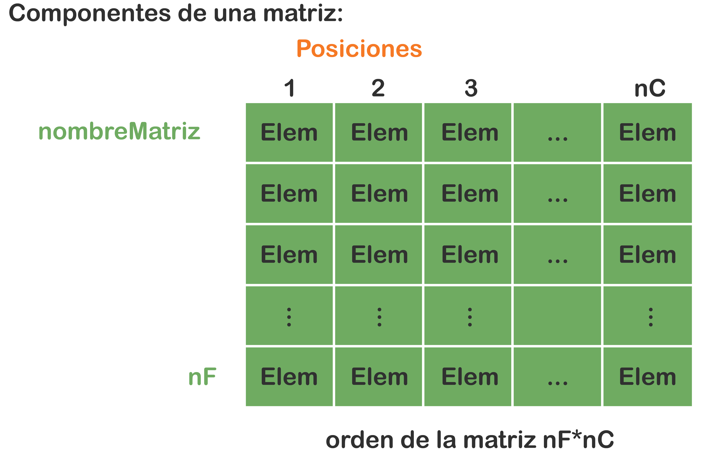
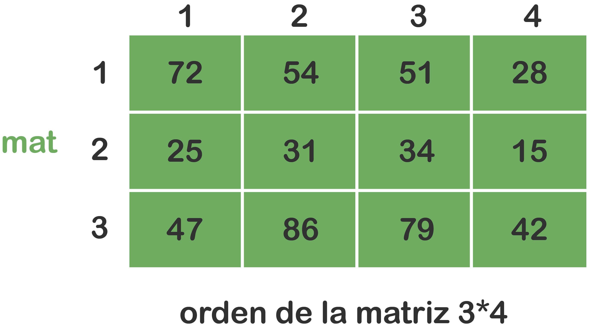

# Arreglos bidimensionales

## Matriz

Un arreglo es un área en la memoria que almacena un grupo de datos (estos pueden ser: o primitivos o tipos de datos definidos por el programador), pero deben ser homogéneos, es decir, del mismo tipo (primitivos del mismo tipo u objetos del mismo tipo). Todo arreglo es una estructura de datos de almacenamiento temporal de información (o sea, sus datos solo permanecen mientras que el programa esté en ejecución); los arreglos se utilizan bajo un manejo estático de memoria, lo cual conlleva que antes de utilizar un arreglo se debe reservar con anterioridad el área que este va a ocupar. Aun así, se corre el riesgo de reservar un área mayor o menor a la necesitada, lo cual implica que la cantidad de memoria reservada no puede cambiar en tiempo de ejecución, esto quiere decir que se establece en tiempo de compilación.

Existen arreglos unidimensionales y multidimensionales, los primeros (una dimensión) son conocidos como listas o vectores. Dentro de los segundos están los bidimensionales (dos dimensiones), conocidos como tablas o matrices. Los arreglos de 3 dimensiones o más son de poca utilización debido a que requieren de mucha memoria para su uso.

En este recurso veremos los arreglos unidimensionales.

### Componentes de una matriz

- **nombreMatriz** : Se refiere al nombre de la matriz, debe ser nemotécnico y único en el programa.
- **Posiciones** : Cada posición está dada por la intersección de una fila con una columna, estas son adyacentes (consecutivas) y en cada una se almacenará un elemento.
- **Elem** : Es el elemento que se guarda en cada posición de la matriz (si la matriz es de tipos de datos primitivos: es el dato; y si la matriz es de datos definidos por el programador: es la referencia al objeto – dirección en memoria del objeto).
- **nC** : Es el número de columnas de la matriz
- **nF** : Es el número de filas de la matriz.
- **orden en la matriz** : Es la cantidad total de elementos que puede almacenar el arreglo (nF * nC).

Los arreglos bidimensionales (matrices) se usan para representar datos que pueden verse como una tabla con filas y columnas.

### Alusión a los datos de una matriz
Cuando necesitemos referirnos a algún elemento de una matriz, debemos escribir el nombre de la matriz seguido de 2 corchetes y dentro de cada uno un subíndice (constante, variable o expresión aritmética) que representa la posición de dicho elemento. Esto teniendo presente que el primer subíndice representa la fila y el segundo representa la columna.

Supón que la siguiente matriz (de tipo de datos primitivo - entero) ya está almacenada en memoria:

Entonces, para hacer alusión al elemento 72 escribimos mat[1][1], al elemento 54 escribimos mat[1][2], al elemento 25 escribimos mat[2][1], etc.

a = mat[1][3] + 4 = 55  
b = mat[2][1] + mat[2][4] = 40  
c = (mat[1][1] - mat[3][4]) / 2 = 15  

![Nota] :
- La posición de un elemento de una matriz puede darse como una constante numérica entera, como un campo variable de tipo numérico entero o como una expresión aritmética.
- Si el campo variable de tipo numérico entero llamado p almacena un 2 y escribimos mat[p][p], nos estaríamos refiriendo al dato de la posición fila 2 columna sea al 81.

### Recorridos sobre matrices
Para recorrer una matriz o visitar una a una sus posiciones, se puede hacer por filas o por columnas. Esa decisión dependerá de lo que se requiera programar.

Los arreglos bidimensionales (matrices) son muy utilizados en problemas de ingeniería, las operaciones dependerán de la aplicación o del problema a resolver.

Entre otras operaciones que se pueden hacer con matrices, podrían ser:

**Recorrido**:
- Por filas
- Por columnas
- Por la diagonal principal o secundaria (si se trata de una matriz cuadrada)

**Ordenamiento de sus elementos**
- Ascendente (< A >)
- Descendente (> A <)
- Alfabético (a – z o A - Z
- Búsqueda
- Multiplicar matrices
- Etc.

## Ejercicios 

1. Elabora una solución lógica que permita cargar en memoria una matriz numérica de orden 3*3. Averigua cuántos elementos de la matriz son mayores que el promedio de la misma matriz.
 

2. Haz una solución lógica que permita cargar en memoria una matriz numérica de orden n*4. Calcula el promedio de las esquinas de la matriz.
 

3. Realiza una solución lógica que permita cargar en memoria una matriz de orden n*x. Intercambia de contenidos a las posiciones:  
    a. Primera y última de la segunda fila.  
    b. Primera y última de la última columna.  

4. Elabora una solución lógica que permita cargar en memoria las matrices numéricas mat1 de orden n*x y mat2 de orden 3*4. Indaga cuántos elementos de la matriz mat1 son mayores que el primer elemento de la matriz mat2.
 

5. Crea una solución lógica que permita cargar en memoria una matriz numérica entera de orden n*x. Conforma:  
a. Un vector con los elementos impares.  
b. Un vector con los elementos pares.  

6. Realiza una solución lógica que permita cargar en memoria la matriz numérica ventas de orden n*12. Conforma:  
a. Un vector con los promedios de cada fila.  
b. Un vector con la suma de cada columna.  

7. Haz una aplicación en JAVA que, utilizando una matriz de caracteres cuadrada de orden n*n y mediante la utilización de un menú, permita ejecutar las siguientes opciones:  
    1. Mostrar un asterisco de tamaño variable generado con asteriscos (*).  
    2. Mostrar un cuadrado de tamaño variable generado con puntos (.).  
    3. Mostrar una X (equis) de tamaño variable generada con la letra equis.  
    4. Mostrar una + (cruz) de tamaño variable generada con el operador + (más).  
    5. Salir  

8. Elabora una solución lógica que permita cargar en memoria una matriz cuadrada de orden n*n cuyos datos son números enteros positivos (validar). Además:  
    a. Averigua cuántos datos impares hay en la diagonal principal.  
    b. Calcula la sumatoria de los datos de la diagonal secundaria.  
    c. Cuenta cuántos datos pares hay en una fila determinada.  
    d. Busca el dato mayor de una columna determinada.  
