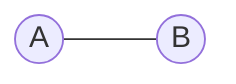
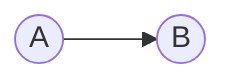
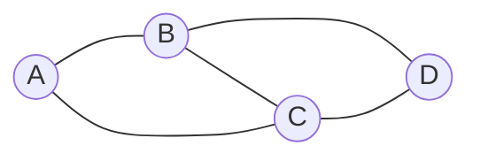
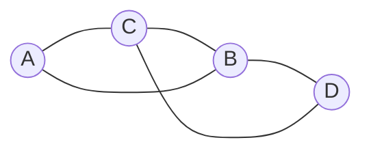

# 1. Definición También en Archivo

Hay muchos sistemas en el mundo natural y en la sociedad que son susceptibles de modelación matemática y computacional. Sin embargo, no todo se codifica fácilmente como un sistema de partículas con coordenadas y momentos. Algunos sistemas y problemas como las redes sociales, las ecologías y los esquemas de regulación genética están intrínsecamente divorciados de las descripciones del espacio-tiempo, y en su lugar se expresan, de manera más natural, como grafos que reflejan sus propiedades topológicas.

En su forma más simple, los grafos son colecciones de nodos que representan una clase de objetos como personas, juntas corporativas, proteínas o destinos en el mundo, además de bordes que sirven para representar conexiones como amistades, puentes o interacciones de unión molecular.

Considere el sistema de carreteras de toda Colombia: un inspector de carreteras tiene la tarea de escribir informes sobre la condición actual de cada una. ¿Cuál sería la forma más económica de atravesar todas las ciudades? El problema se puede modelar como un grafo.

De hecho, como los grafos son puntos y líneas, parecen mapas de carreteras. Los puntos se llaman vértices o nodos y las líneas se llaman lados o aristas. Pueden tener un valor asignado (ponderado) o, simplemente, pueden ser un mero indicador de la existencia de un camino (no ponderado). Formalmente, un grafo se puede definir de la siguiente manera:

![Definición] Un grafo G consiste en un conjunto de V de vértices (o nodos) y un conjunto E de aristas (o lados), de modo que cada arista c € E esté asociada con un par de vértices v, u ∈ V. Un grafo G con vértices V y aristas E se escribe como G = (V,E).

Debido a que los grafos son tan generalizados, es útil definir diferentes tipos de ellos. Los siguientes son los más comunes:

**Grafo no dirigido** : sus bordes no tienen orientaciones, es decir, ninguna dirección está asociada con ningún borde. Los bordes (x, y) y (y, x) son equivalentes.

**Grafo dirigido** : también llamado dígrafo G, consiste en un conjunto V de vértices (o nodos) y un conjunto de aristas (o arcos) de modo que cada arista e ∈ E está asociada con un par ordenado de vértices. Si hay un borde (x, y), es completamente distinto del borde (y, x).

Note que un grafo puede ser lo siguiente:

( {a, b, c, d}, { {a, b}, {a, c}, {b, c}, {b, d}, {c, d} } )

Cabe resaltar que no hay puntos ni líneas, sino un par ordenado de dos conjuntos. Este es un grafo con cuatro vértices y cinco lados.

La representación grafica del grafo anterior, puede ser cualquiera de los siguientes:

**Adyacencia:** dos vértices: A y B, son adyacentes si ellos comparten la misma arista.

En el ejemplo anterior A y B son adyacentes y A y D no son adyacentes.

Arriba se representa un grafo dibujándolo, sin embargo, para hacerlo en una computadora, se requieren maneras más formales de representación. Aquí se discuten las dos formas más comunes de representar un grafo: la matriz de adyacencia y la lista de adyacencia, está última es la mostrada arriba.

# En Archivo :
2. Matriz de Adyacencia
3. Matriz de Incidencia
4. Tipos de Grafos
5. Grafos especiales
	En la teoría de grafos, existen algunos de ellos que cumplen ciertas propiedades y que son fundamentales para hacer contraejemplos a teoremas.