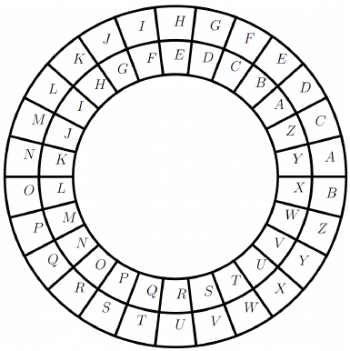

## Definición

Es un criptosistema donde la clave para encriptar y para desencriptar un mensaje es igual. En este sistema, si bien la clave debe ser secreta, tanto el emisor del mensaje como el receptor de la clave deben tener acceso a esta.

Lo que se hace es tomar el texto plano y cifrarlo directamente con la clave, lo que entrega el mensaje cifrado que puede ser enviado por el canal de ruido. El proceso de descifrado es esencialmente el reverso del proceso de encriptación; para conseguir de nuevo el texto plano, se recibe el texto ya cifrado y usar la misma clave.

Los sistemas criptográficos simétricos se utilizan ampliamente para la comunicación segura en una variedad de aplicaciones, como lo son banca en línea, comercio electrónico y sistemas de mensajería seguros. Algunos ejemplos de sistemas criptográficos de clave simétrica incluyen el estándar de encriptación avanzada (AES), el estándar de encriptación de datos (DES) y el triple DES, los cuales son los más usados en la actualidad.

Las principales ventajas de los sistemas criptográficos simétricos es la velocidad y la eficiencia, ya que requieren menos potencia de procesamiento y memoria en comparación con otros métodos de encriptación, como los sistemas criptográficos asimétricos. Sin embargo, una desventaja significativa es la dificultad de distribuir y administrar la clave secreta de manera segura, especialmente en sistemas a gran escala con múltiples usuarios. Si la clave secreta se compromete puede llegar a ser utilizada por un atacante para descifrar todos los mensajes.

Es importante destacar que, en la actualidad, la mayoría de la criptografía se hace con códigos, por lo que no es importante contar con algún tipo de vocabulario particular. Antiguamente se enviaban mensajes para ello, por lo que la creación de un vocabulario especializado hacía parte del proceso criptográfico. En estos casos, el criptosistema se basa en sustituir cada letra del alfabeto por un número, por lo que la cantidad de letras en el alfabeto utilizado puede afectar la seguridad del mensaje. Si se usa un idioma cuyo alfabeto contiene menos letras, como es el caso de algunas lenguas asiáticas, el mensaje será más fácil de descifrar ya que hay menos posibilidades de sustitución. De igual modo, el proceso se complica si se usa una lengua con una estructura gramatical más compleja, por lo que para un atacante puede llegar a ser más difícil.

En este curso se elije el siguiente alfabeto para los ejemplos y simplificación de la notación, sin embargo, puede cambiar en algún momento para efectos de evaluación.

| Letra  | A   | B   | C   | D   | E   | F   | G   | H   | I   | J   | K   | L   | M   | N   | O   | P   | Q   | R   | S   | T   | U   | V   | W   | X   | Y   | Z   |
| ------ | --- | --- | --- | --- | --- | --- | --- | --- | --- | --- | --- | --- | --- | --- | --- | --- | --- | --- | --- | --- | --- | --- | --- | --- | --- | --- |
| Numero | 00  | 01  | 02  | 03  | 04  | 05  | 06  | 07  | 08  | 09  | 10  | 11  | 12  | 13  | 14  | 15  | 16  | 17  | 18  | 19  | 20  | 21  | 22  | 23  | 24  | 25  |

El estudiante debe tener en cuenta que el texto plano se debe escribir en letras minúsculas y el cifrado en mayúsculas. Además, se pueden escribir los mensajes con o sin espacio dependiendo del acuerdo al que se llegue respecto a cómo serán las comunicaciones; si se usa, este debe tomarse como un nuevo carácter a considerar. El español, por ejemplo, contiene marcas gráficas indispensables para el entendimiento, como lo son las tildes, la diéresis y la virgulilla. Si se quiere adoptar estos signos u otros bits para la comunicación, se debe hacer por acuerdo.

En este curso se agregarán los espacios en el mensaje; sin embargo, tener en cuenta que esto puede llegar a ser perjudicial, pues si un interceptor conoce la lengua puede identificar las letras más comunes de esta y, de esta forma, descifrar la clave.

Ahora se presentan algunos criptosistemas simples usados a lo largo de la historia.

## Cifrado de César

El cifrado César es un cifrado de sustitución simple que fue utilizado por Julio César para cifrar mensajes. En este, cada letra en el texto sin formato se desplaza un cierto número de lugares hacia abajo en el alfabeto. Con el lenguaje elegido se debe considerar que el número a desplazar debe ser uno entre 0 y 25, obviamente no se va a escoger el cero. Así, todo se debe hacer módulo 26, que es la cantidad de letras que se han tomado.

Matemáticamente se puede tomar cada letra del texto plano como pp, y la clave cc; para cifrar se usa:
	p + c ≡ C mod 26
Y si se reemplaza cada letra se obtiene el mensaje cifrado.

Para descifrar se despeja p en la ecuación anterior y se llega a que:
	C − c ≡ p mod 26
Y con esto se consigue de nuevo el texto plano.

Por ejemplo, se se toma como clave a 3, entonces la letra "a" en el texto plano se reemplaza por la letra "D" en el texto cifrado por medio de 0 + 3 ≡ 3 mod 26, "a" se convierte en "E" por medio de 1 + 3 ≡ 4 mod 26, y así sucesivamente. Cuando se llega al final del alfabeto, el recuento comienza de nuevo desde el principio.

Aquí hay un ejemplo de un cifrado César con un desplazamiento de 3. La siguiente figura muestra un generador de claves; se supone que las letras internas son el texto plano y si se mueve tres unidades el círculo externo en sentido de las manecillas del reloj, se obtiene la letra por la cual debe ser cambiada al cifrar, así el emisor puede hacer el código cifrado fácilmente.

Por ejemplo, si se tiene el texto plano "me gusta estudiar", en la figura se puede observar que el texto cifrado es: "PH JXVWD HVWXGLDU".

Pero hay 25 posibles desplazamientos, así que el mismo texto plano puede dar 25 posibles códigos cifrados diferentes. Esto representa una debilidad del cifrado de Cesar, lo que lo hace vulnerable a ataques usando fuerza bruta. Además, el cifrado César es vulnerable a los ataques de análisis de frecuencia, en los que un atacante analiza la frecuencia de aparición de cada letra en el texto cifrado y la compara con la frecuencia de aparición de letras en el idioma español. Dado que algunas letras aparecen regularmente en tanto que otras no, un atacante puede, un atacante puede usar este conocimiento para hacer conjeturas fundamentadas sobre el texto plano.

El cifrado César también es vulnerable a ataques de texto plano, en los que un atacante conoce o puede adivinar parte del texto plano y el texto cifrado correspondiente, y utiliza esta información para deducir la clave y descifrar el resto del mensaje.

En general, el cifrado César es una técnica de cifrado muy débil y no debe usarse para comunicaciones confidenciales.

Use la clave 7 para encriptar el texto plano "amo las matemáticas". ¿Cuál de los siguientes mensajes cifrados cumple?
- [ ] LXZ WLD XLEPXLETNLD
- [ ] TFH ETL FTMXFTMBVTL
- [ ] IUW TIA UIBMUIBQKIA
- [x] HTV SHZ THALTHAPJHZ
**_Comentario_** :  
	La respuesta correcta es HTV SHZ THALTHAPJHZ. Note que si a se corre 7 unidades en el círculo anterior da H y este es el único código que empieza por H.

![Reto] Halle la clave si conoce que las palabras cifradas son:
- ZNGRZNGVPNF
- FVFGRZNF
- RFGHQVNE
- IVEGHNYVQNQ
- RKPRYRAPVN
- VATRAVREVN
- HAVIREFVQNQ
Su respuesta : [13]  
_Comentario_:  
	La respuesta es **13**, dado que al usar la fuerza bruta se entiende que las letras más frecuentes son N, R y V; según el español estas deben ser vocales. Al ensayar la E en la que más aparece, es decir, la V, no concuerda e igualmente para la AA, sin embargo, al usar la I, se puede concluir que sí encaja en V, lo que significa que la clave es 13.
**Soluciones** :
- ZNGRZNGVPNF → **MATEMATICAS**
- FVFGRZNF → **SISTEMAS**
- RFGHQVNE → **ESTUDIAR**
- IVEGHNYVQNQ → **VIRTUALIDAD**
- RKPRYRAPVN → **EXCELENCIA**
- VATRAVREVN → **INGENIERIA**
- HAVIREFVQNQ → **UNIVERSIDAD**

![Reto] En el reto anterior use la clave para desencriptar la última palabra.
Su respuesta : [Universidad]  
**_Comentario_** :
	La respuesta es "universidad''. Se puede llegar a ella usando la clave y la fórmula:
		p ≡ C − x mod 26.
## Cifrado de César mejorado o cifrado afín

El cifrado afín es un tipo de técnica de cifrado similar al César, pero que proporciona un mayor nivel de seguridad. En este caso se toman dos claves, a y b, donde a es un número entre 1 y 25 y debe satisfacer que mcd(a, 26) = 1, y b es un número entre 0 y 25.

Para cifrar un mensaje con el cifrado afín, cada letra del texto plano se asigna primero a un número entre 0 y 25, como la tabla. Luego, el número se multiplica por a y se suma a b, y el resultado se toma módulo 26 para obtener la letra del texto cifrado. La fórmula para el cifrado es:
	C ≡ ap + b mod 2
	
Donde C es la letra del texto cifrado y p es la letra del texto plano. Recuerde que a y b son las claves de cifrado.

La debilidad del cifrado afín es que sigue siendo vulnerable a los ataques de análisis de frecuencia, así como a los ataques de fuerza bruta si las claves no se eligen con cuidado. Si un atacante conoce el texto cifrado y el texto sin formato correspondiente de una letra en particular, puede usar esa información para deducir las claves de cifrado.

Sin embargo, si las claves se eligen al azar y se mantienen en secreto, el cifrado afín puede ser una técnica razonablemente segura, especialmente si el mensaje es corto y el atacante tiene información limitada.
#### Ejemplo 1

**Ejemplo** : Si se tiene como claves a — 3 y b — 8, encriptar eI texto plano "esto es un secreto".

Para encriptar el texto plano se va a escribir en una tabla los valores de cada letra:

| Texto plano         | e   | s   | t   | o   | e   | s   | s   | e   | c   | r   | e   | t   | o   |
| ------------------- | --- | --- | --- | --- | --- | --- | --- | --- | --- | --- | --- | --- | --- |
| Codigo              | 04  | 18  | 19  | 14  | 04  | 18  | 18  | 04  | 02  | 17  | 04  | 19  | 14  |
| Codigo usando clace | 20  | 10  | 13  | 24  | 20  | 10  | 10  | 20  | 14  | 07  | 20  | 13  | 24  |
| Texto cifrado       | U   | N   | K   | Y   | U   | K   | K   | U   | O   | H   | U   | N   | Y   |

Recuerde que los cálculos del código usando clave se consiguieron haciendo:  
	5 ⋅ 04 + 8 ≡ 20 mod 26  
	5 ⋅ 18 + 8 ≡ 10 mod 26  
	5 ⋅ 19 + 8 ≡ 13 mod 26  
	5 ⋅ 14 + 8 ≡ 24 mod 26  
	5 ⋅ 04 + 8 ≡ 20 mod 26  
	5 ⋅ 18 + 8 ≡ 10 mod 26  
	5 ⋅ 18 + 8 ≡ 10 mod 26  
	5 ⋅ 04 + 8 ≡ 20 mod 26  
	5 ⋅ 02 + 8 ≡ 14 mod 26  
	5 ⋅ 17 + 8 ≡ 07 mod 26  
	5 ⋅ 04 + 8 ≡ 20 mod 26  
	5 ⋅ 19 + 8 ≡ 13 mod 26  
	5 ⋅ 14 + 8 ≡ 24 mod 26  
Así, el texto encriptado es "UKNY UK KUOHUNY".
#### Ejemplo 2

**Ejemplo** : Con la misma clave del texto anterior descifrar "OGXHIH UK XIOGP"
Se debe conocer el inverso de $a=3$ módulo $26$ y este es $9$; de esta manera, forma de descifrar es:
	p ≡ 9(C − 8) mod 26
Así:
	9(14−8) ≡ 02 mod 26
	9(06−8) ≡ 08 mod 26
	9(23−8) ≡ 05 mod 26
	9(07−8) ≡ 17 mod 26
	9(08−8) ≡ 00 mod 26
	9(07−8) ≡ 17 mod 26
	9(20−8) ≡ 04 mod 26
	9(10−8) ≡ 18 mod 26
	9(23−8) ≡ 05 mod 26
	9(08−8) ≡ 00 mod 26
	9(14−8) ≡ 02 mod 26
	9(06−8) ≡ 08 mod 26
	9(15−8) ≡ 11 mod 26
Lo que lleva a que el texto plano es "cifrar es fácil".

Es importante tener en cuenta que si el mensaje es interceptado y el atacante reconoce, por lo menos, la transformación de dos letras en el cifrado de César mejorado, entonces conocerá la clave. El siguiente ejemplo muestra como lo hace.
#### Ejemplo 3

**Ejemplo** : Si se conoce que al encriptar con eI cifrado de César mejorado l → U y u → F, encuentre la clave.

Para esto se conoce que los códigos son 11 → 20 y que 20 → 05, y se debe encontrar los valores de a y b. Así, al usar la fórmula para encriptar, se obtienen las siguientes dos ecuaciones:
	a ⋅ 11 + b ≡ 20 mod 26
	a ⋅ 20 + b ≡ 05 mod 26

Restando las dos ecuaciones se obtiene que (11−20) a ≡ 15 mod 26, lo que es lo mismo que:
	−9a ≡ 15 mod 26

Que es una ecuación lineal, la cual, al multiplicar por −3, conlleva al siguiente resultado:
	27a ≡ −45 mod 26

Lo que lleva a que a ≡ 7 mod 26 y así a = 7, al reemplazar este valor en cualquiera de las dos ecuaciones se encuentra b.

Si se reemplaza en la primera de las ecuaciones 7 ⋅ 11 + b ≡ 20 mod 26, que es:
	77 + b ≡ 20 mod 26

Al simplificar se obtiene:
	−1 + b ≡ 20 mod 26

Y al despejar b, se llega a que:
	b ≡ 21 mod 26

Por lo tanto b = 21. Así que la clave total es a = 7 y b = 21.

## Cifrado de Vigenére

Es un método de cifrado polialfabético que se basa en utilizar diferentes series de letras de la tabla (de letras), para cifrar cada una del mensaje original. Fue inventado por el criptógrafo francés Blaise de Vigenère en el siglo XVI.

Para encriptar un mensaje con el cifrado de Vigenère se utiliza una palabra clave o frase que se repite tantas veces como sea necesario para cifrar todo el mensaje.

El cifrado se realiza sumando el valor numérico de cada letra del mensaje original con el valor numérico de la letra correspondiente de la palabra clave, utilizando la tabla de letras. Si el resultado es mayor que el número total de letras de la tabla, se vuelve a empezar desde el principio con la clave.

Para descifrar el mensaje cifrado se utiliza la misma palabra clave y el mismo procedimiento, pero restando en lugar de sumar.

A pesar de que el cifrado de Vigenère fue considerado seguro en su época, en la actualidad se considera un cifrado débil, ya que es vulnerable a ataques de fuerza bruta y otros métodos criptográficos más sofisticados.

#### Ejemplo

**Ejemplo** : Cifrar "Esto es un secreto" con la clave es "luna"

Se debe hacer la suma módulo 26 con los códigos de las letras, la siguiente tabla lo muestra:

| Texto palno        | e   | s   | t   | o   | e   | s   | u   | n   | s   | e   | c   | r   | e   | t   | o   |
| ------------------ | --- | --- | --- | --- | --- | --- | --- | --- | --- | --- | --- | --- | --- | --- | --- |
| Clave              | l   | u   | n   | a   | l   | u   | n   | a   | l   | u   | n   | a   | l   | u   | n   |
| Codigo texto plano | 04  | 18  | 19  | 14  | 04  | 18  | 20  | 13  | 18  | 04  | 02  | 17  | 04  | 19  | 14  |
| Clave              | 11  | 20  | 13  | 00  | 11  | 20  | 13  | 00  | 11  | 20  | 13  | 00  | 11  | 20  | 13  |
| Suma mod 26        | 15  | 12  | 05  | 14  | 15  | 12  | 07  | 13  | 03  | 24  | 15  | 17  | 15  | 13  | 01  |
| Texto cifrado      | P   | M   | F   | O   | P   | M   | H   | N   | D   | Y   | P   | R   | P   | N   | B   |

Por lo tanto, el texto cifrado es "PMFO PM HN DYPRPNB''.

Note que en el cifrado de Vigenère las letras son diferentes, debido a que la clave puede tener el mismo código de cifrado.

Las ventajas de usar el cifrado de Vigenère sobre los otros cifrados son: es un cifrado más fuerte que los cifrados mono-alfabéticos como el César o el cifrado afín, ya que utiliza varias tablas de sustitución; el cifrado de Vigenère es muy fácil de entender y de aplicar; no requiere un conocimiento especializado para entender el cifrado y descifrado del mensaje, solo saber manejar los módulos; es resistente a algunos tipos de ataques criptográficos como el análisis de frecuencia.

Las desventajas son: el cifrado de Vigenère puede ser vulnerado con la ayuda de algoritmos de descifrado; es vulnerable a ataques de fuerza bruta, ya que con una clave suficientemente larga el cifrado puede ser descifrado sin mucha dificultad; aunque es un cifrado poli-alfabético su fortaleza disminuye si la longitud de la clave es corta o se repiten letras.

Al cifrar usando el cifrado de Vigenère con la clave "secreto'', ¿cuál de las siguientes palabras no usó esa clave?:
- [ ] UMHIEK
- [ ] SKGQEHXF
- [x] WANSAFMF
- [ ] WSKGKWVTF
_Comentario_:  
	La respuesta es "WANSAFMF''. Si prueba restando la clave, se puede descubrir que las otras tienen un mensaje lógico y la palabra mostrada no da una palabra del español.

  

## Ejercicios en Archivo

## Cifrado Playfair

Es un cifrado simétrico que se utiliza para cifrar mensajes en texto claro en un formato de pares de letras. Este cifrado fue desarrollado por Charles Wheatstone en 1854 y popularizado por Lord Playfair durante la Primera Guerra Mundial.

Este cifrado se basa en un bloque de $5×5$, en el cual la primera clave es playfair. Esta se pone en el bloque primero, llenando la fila uno de izquierda a derecha, y así hasta completar todas las letras, sin repetir; el resto de casillas se llena con las letras en orden alfabetico hasta completar todo el abecedario y sin repetir letras. Además, se debe considerar una letra reemplace a otra, ya que no se tienen $26$ cuadrados en el bloque. Así, el bloque queda:

| P   | L   | A   | Y   | F   |
| --- | --- | --- | --- | --- |
| I   | R   | B   | C   | D   |
| E   | G   | H   | J   | M   |
| N   | O   | Q   | S   | T   |
| U   | V   | W   | X   | Z   |

Note que la palabra playfair es la primera que aparece y como la "i" se repite dos veces se evitan las repeticiones, para el caso de la letra "k" se evitó ponerla y se reemplaza por una "j", en caso de aparecer.

Para encriptar se deben tener en cuenta las siguientes consideraciones:
- Creación de pares de letras: el mensaje a cifrar se divide en pares de letras. Si hay una letra impar al final se añade una "X" al final del mensaje. Si hay dos letras iguales juntas se inserta una "X" entre ellas. Por ejemplo, el mensaje "HOLA AMIGO" se convierte en "HO LA AM IX GO".
- Si las dos letras se encuentran en la misma fila de la matriz se sustituyen por las dos letras inmediatamente a su derecha (si están en la última columna, se sustituyen por la letra de la primera columna). Por ejemplo:

| P   | L     | A     | Y   | F   |
| --- | ----- | ----- | --- | --- |
| I   | ==R== | ==B== | C   | D   |
| E   | G     | H     | J   | M   |
| N   | O     | Q     | S   | T   |
| U   | V     | W     | X   | Z   |

Se sustituye por:

| P   | L   | A     | Y     | F   |
| --- | --- | ----- | ----- | --- |
| I   | R   | ==B== | ==C== | D   |
| E   | G   | H     | J     | M   |
| N   | O   | Q     | S     | T   |
| U   | V   | W     | X     | Z   |

Pero si las letras son:    

| P   | L   | A   | Y     | F     |
| --- | --- | --- | ----- | ----- |
| I   | R   | B   | ==C== | ==D== |
| E   | G   | H   | J     | M     |
| N   | O   | Q   | S     | T     |
| U   | V   | W   | X     | Z     |

Se cambian por:

| P     | L   | A   | Y   | F     |
| ----- | --- | --- | --- | ----- |
| ==I== | R   | B   | C   | ==D== |
| E     | G   | H   | J   | M     |
| N     | O   | Q   | S   | T     |
| U     | V   | W   | X   | Z     |

- Si las dos letras se encuentran en la misma columna de la matriz, se sustituyen por las dos letras inmediatamente debajo de ellas (si están en la última fila, se sustituye por la letra de la primera). Por ejemplo, si se quiere cambiar las letras

| P   | L     | A   | Y   | F   |
| --- | ----- | --- | --- | --- |
| I   | ==R== | B   | C   | D   |
| E   | ==G== | H   | J   | M   |
| N   | O     | Q   | S   | T   |
| U   | V     | W   | X   | Z   |
Se cambian por:

| P   | L     | A   | Y   | F   |
| --- | ----- | --- | --- | --- |
| I   | R     | B   | C   | D   |
| E   | ==G== | H   | J   | M   |
| N   | ==O== | Q   | S   | T   |
| U   | V     | W   | X   | Z   |

Pero si lo que se quiere es cambiar:

| P   | L     | A   | Y   | F   |
| --- | ----- | --- | --- | --- |
| I   | R     | B   | C   | D   |
| E   | G     | H   | J   | M   |
| N   | ==O== | Q   | S   | T   |
| U   | ==V== | W   | X   | Z   |

Entonces, se cambian por:

| P   | ==L== | A   | Y   | F   |
| --- | ----- | --- | --- | --- |
| I   | R     | B   | C   | D   |
| E   | G     | H   | J   | M   |
| N   | O     | Q   | S   | T   |
| U   | ==V== | W   | X   | Z   |

- Si las dos letras no se encuentran en la misma fila ni en la misma columna, se intercambian por las dos letras en la misma fila, pero en la columna de la otra letra del par. Por ejemplo, si se tiene que cambiar lo que esta sombreado en rojo, se hace por lo verde:

| P   | L     | A   | Y     | F   |
| --- | ----- | --- | ----- | --- |
| I   | =R=   | B   | ==C== | D   |
| E   | G     | H   | J     | M   |
| N   | ==O== | Q   | =S=   | T   |
| U   | V     | W   | X     | Z   |

Ahora, para cifrar "HO LA XA MI GO" queda "GQ AY WY ED OV". Verífiquelo.

El tablero para cifrar y descifrar en el cifrado de Playfair puede ser cambiado por alguna palabra o frase que los interesados quieran, por ejemplo, si se toma como palabra clave "discretas'', entonces el tablero queda:

| D   | I   | S   | C   | R   |
| --- | --- | --- | --- | --- |
| E   | T   | A   | B   | F   |
| G   | H   | J   | L   | M   |
| N   | O   | P   | Q   | U   |
| V   | W   | X   | Y   | Z   |

La letra que falta de nuevo es la K, la cual se reemplaza por una J, es decir, K=JK=J, y que la letra que se usa para completar parejas o separar letras iguales en este caso es la YY.

Así, si se quiere cifrar "hello world'', el emparejamiento queda HE LY LO WO RL DY, y al cifrar con el nuevo tablero queda GT QC HQ IW CM CV.

En general, cualquier palabra o frase puede ser usado en PlayFair, pero la idea es tener palabras o frases que hagan que el tablero quede, de cierta forma, bien distribuido en el sentido del alfabeto.

