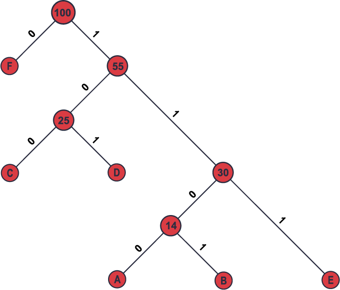

# Definición

En la teoría de la codificación, un codificador es una función que toma un mensaje o datos y los convierte en un código que se puede transmitir a través de un canal de comunicación con una tasa de error más baja.

El propósito de un codificador es agregar redundancia a los datos para que los errores puedan detectarse y corregirse en el extremo del receptor.

Por otro lado, un decodificador es una función que toma un código recibido e intenta recuperar el mensaje o los datos originales. El decodificador utiliza la redundancia añadida por el codificador para corregir errores que puedan haber ocurrido durante la transmisión.

En muchos esquemas de codificación el codificador y el decodificador están diseñados para trabajar juntos y así proporcionar un alto nivel de corrección de errores. La elección de estos depende del canal de comunicación específico y de los tipos de errores que probablemente ocurran.

Algunos esquemas de codificación populares incluyen códigos Reed-Solomon, convolucionales y turbo. Estos utilizan diferentes técnicas de codificación y decodificación para proporcionar distintos niveles de corrección de errores, según las necesidades específicas de la aplicación.

En este material se estudiarán los codificadores simples, sin embargo, se presentarán algunos que se usan en varias ramas de la ingeniería de sistemas, como la ciencia de datos.

# Codificadores de repetición

El codificador de repetición es uno de los más simples utilizado en la teoría de la codificación. La idea detrás de este es muy sencilla: cada bit de datos se repite varias veces para crear una secuencia redundante. De esta manera se puede detectar, fácilmente, si se produce un error en la transmisión.

Por ejemplo, si se utiliza un codificador de repetición con un factor de repetición de 3, cada bit de datos se repetiría 3 veces. Entonces, un bit "0" se convertiría en "000" y un bit "1" se convertiría en "111". Por lo tanto, una secuencia de datos como "110101" se convertirá en "111000111111000111000111111111000111".

La detección de errores con el codificador de repetición es muy sencilla. Si un bit se corrompe en la transmisión, la mayoría de las repeticiones estarán en desacuerdo con las otras repeticiones, lo que indica un error. Por ejemplo, si en la secuencia anterior el segundo bit "1" se corrompe y se convierte en "0", la secuencia recibida sería "1110000111111000111000111111111000111". Al comparar las repeticiones, se puede ver que hay un desacuerdo en la segunda repetición, lo que indica el error.

Sin embargo, el codificador de repetición no es capaz de corregir errores, solo puede detectarlos y solicitar una retransmisión del paquete de datos. Además, el uso de una gran cantidad de bits redundantes puede aumentar, significativamente, la cantidad de datos que deben ser transmitidos. Por lo tanto, el codificador de repetición es, generalmente, utilizado como una medida de seguridad adicional junto con otros métodos de codificación más complejos.

Para codificar un mensaje usando el codificador de repetición, se sigue el siguiente proceso:

1. Dividir el mensaje en bits: el mensaje que se desea codificar se convierte en una secuencia de bits.
2. Repetir cada bit: cada bit en la secuencia se repite un número de veces determinado por el factor de repetición. Por ejemplo, si se utiliza un factor de repetición de 3, cada bit se repetiría 3 veces.
3. Enviar la secuencia codificada: la secuencia de bits codificada se envía al receptor.

Por ejemplo, si se considera el mensaje "HOLA". Primero, se convierte cada letra en su representación binaria ASCII. Por ejemplo, la letra "H" se representa como "01001000". A continuación, se repiten los bits utilizando un factor de repetición de 3, por lo que "01001000" se convierte en:

``0000001111110000000111111000000011111100000001111110000000111111``

Esto es lo que se envía al receptor.

Cuando el receptor recibe la secuencia codificada, puede realizar una detección de errores comparando las repeticiones. Si hay algún desacuerdo en la repetición de un bit, se sabe que ha habido un error. Sin embargo, como se mencionó anteriormente, el codificador de repetición no es capaz de corregir errores, por lo que la acción a tomar, en caso de error, sería solicitar una retransmisión del mensaje.

# Codificador de paridad

Este es otro de los codificadores más simples que se utilizan en la teoría de la codificación. Se agrega un bit adicional al mensaje de datos para que la cantidad total de unos en la secuencia sea par o impar. Esto se logra mediante el cálculo de la paridad del mensaje de datos y la adición de un bit de paridad al **final de la secuencia**.

Por ejemplo, si se tiene una secuencia de datos de 7 bits, el codificador de paridad agregaría un octavo bit para hacer que el número total de unos en la secuencia sea par o impar, dependiendo del tipo de paridad que se esté utilizando.

- Si se está utilizando paridad par, el bit adicional se establecerá en un valor tal que la cantidad total de unos en la secuencia (incluyendo el bit adicional) sea par.
- Si se está utilizando paridad impar, el bit adicional se establecerá en un valor tal que la cantidad total de unos en la secuencia sea impar.

Por ejemplo, suponga que se tiene la secuencia de datos 1010101 y se usa la paridad par. La cantidad total de unos en la secuencia es 4 -número par-. Por lo tanto, el bit de paridad adicional se establecería en "0", haciendo que la cantidad total de unos en la secuencia sea 4.

El codificador de paridad es también bastante simple. Si se produce un error en la transmisión de la secuencia, se puede detectar mediante el cálculo de la paridad de la secuencia recibida y comparándola con el bit de paridad adicional que se recibió -junto con la secuencia-. Si la paridad de la secuencia recibida no coincide con el bit de paridad adicional, se sabe que ha habido un error en la transmisión.

Por ejemplo, si se quiere transmitir el mensaje "HOLA'' se deben seguir los siguientes pasos:

1. Convertir el mensaje "HOLA'' a su representación binaria ASCII:

| h        | o        | l        | a        |
| -------- | -------- | -------- | -------- |
| 01101000 | 01101111 | 01101100 | 01100001 |

2. Calcular la paridad de cada byte de datos y agregar un bit de paridad:

| Byte de datos | Datos    | Paridad | Total de unos | Paridad final |
| ------------- | -------- | ------- | ------------- | ------------- |
| 1             | 01101000 | 1       | 3             | 1             |
| 2             | 01101111 | 0       | 6             | 0             |
| 3             | 01101100 | 1       | 4             | 0             |
| 4             | 01100001 | 0       | 3             | 1             |

3. Concatenar los bytes de datos codificados: 01101000 1 01101111 0 01101100 1 01100001 0

Sin embargo, al igual que con el codificador de repetición, el de paridad no es capaz de corregir errores, solo puede detectarlos y solicitar una retransmisión del paquete de datos. Por lo tanto, el codificador de paridad también se utiliza, generalmente, como una medida de seguridad adicional junto con otros métodos de más complejos.

# Codificador de longitud limitada

Es un tipo de codificación que se utiliza en la teoría de la información y en la compresión de datos. Consiste en asignar códigos más cortos a los símbolos que ocurren con mayor frecuencia y códigos más largos a los símbolos que ocurren con menor frecuencia.

Existen diferentes técnicas para la construcción de codificadores de longitud limitada, como el método de Huffman y el método de Shannon-Fano. Ambos se basan en la construcción de un árbol de codificación, en el que se van asignando códigos a los símbolos en función de su frecuencia de aparición en el texto a codificar.

Paso 1: Ordenar los símbolos según su frecuencia:

| Simbolo | Frecuencia |
| ------- | ---------- |
| A       | 5          |
| B       | 9          |
| C       | 12         |
| D       | 13         |
| E       | 16         |
| F       | 45         |

Paso 2: Sumar los dos con menor frecuencia y la suma se reordena en la lista, es decir:

| Simbolo | Frecuencia |
| ------- | ---------- |
| C       | 12         |
| D       | 13         |
| A + B   | 14         |
| E       | 16         |
| F       | 45         |

Paso 3: Se hace lo mismo hasta completar todas las sumas:

| Simbolo | Frecuencia |
| ------- | ---------- |
| A + B   | 14         |
| E       | 16         |
| C + D   | 25         |
| F       | 45         |

Luego

| Simbolo     | Frecuencia |
| ----------- | ---------- |
| C +D        | 25         |
| (A + B) + E | 30         |
| F           | 45         |

Después

| Simbolo                | Frecuencia |
| ---------------------- | ---------- |
| F                      | 45         |
| (C +D) + ((A + B) + E) | 55         |

y por último

| Simbolo                      | Freciencia |
| ---------------------------- | ---------- |
| F + ((C +D) + ((A + B) + E)) | 100        |

Cada uno de los símbolos es una hoja del árbol binario que es igual a:

Así, los códigos quedan:

| Simbolo | Frecuencia | Codigo |
| ------- | ---------- | ------ |
| A       | 5          | 1100   |
| B       | 9          | 1101   |
| C       | 12         | 100    |
| D       | 13         | 101    |
| E       | 16         | 111    |
| F       | 45         | 0      |

El algoritmo de codificación de Huffman comienza por calcular la frecuencia de aparición de cada símbolo en la secuencia de entrada. A continuación, se construye un árbol binario que representa la distribución de frecuencia de los símbolos. En este árbol, cada hoja representa un símbolo y su peso corresponde a su frecuencia de aparición. Las hojas se unen para formar nodos más grandes, que también tienen un peso igual a la suma de los pesos de sus hojas. Este proceso continúa hasta que se llega a la raíz del árbol, que tiene un peso igual a la suma de los pesos de todas las hojas.

Una vez construido el árbol, se asigna un código a cada símbolo de entrada de la siguiente manera: se recorre el árbol desde la raíz hasta la hoja correspondiente al símbolo y se asigna un 0 a cada rama izquierda y un 1 a cada rama derecha. El código asignado a cada símbolo es la secuencia de 0's y 1's que se obtiene al recorrer el árbol desde la raíz hasta la hoja correspondiente.

La codificación de Huffman es eficiente en términos de la relación de compresión, es decir, la cantidad de datos comprimidos en relación con la cantidad de datos originales. Sin embargo, el proceso de codificación y decodificación puede ser costoso en términos de tiempo de procesamiento, especialmente para secuencias de entrada largas.

Para los decodificadores se deben seguir las siguientes reglas:

Los decodificadores para los codificadores de longitud limitada, de paridad y de repetición son bastante sencillos y directos.

Para el codificador de longitud limitada, el decodificador simplemente debe dividir el mensaje recibido en bloques de la longitud correspondiente y luego buscar en la tabla de codificación para encontrar el carácter correspondiente a cada bloque.

Para el codificador de paridad, el decodificador debe verificar la paridad del mensaje recibido y corregir cualquier error si es posible. Si la paridad no es correcta, el decodificador debe indicar que se ha producido un error y solicitar la retransmisión del mensaje.

Para el codificador de repetición, el decodificador debe contar el número de veces que aparece cada bit en el mensaje recibido y luego determinar el valor del bit decodificado como el valor que aparece con más frecuencia.

# Ejercicios en Archivo