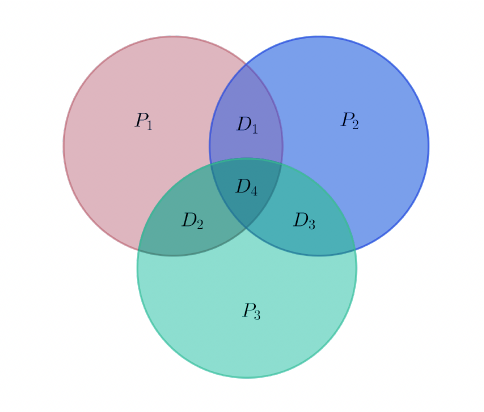

# Códigos lineales

Los códigos lineales son un tipo de código de corrección de errores que se utiliza en la teoría de la información y la teoría de la codificación. Se denominan así porque las palabras en el código son combinaciones lineales de un conjunto fijo de vectores base sobre un campo finito $F^{n}$.

En otras palabras, un código lineal es un subespacio de un espacio vectorial $V$ sobre un campo finito $F^{n}$, y las palabras del código son los elementos de este subespacio. Los vectores base del subespacio se eligen de manera que cualquier palabra de código pueda expresarse como una combinación lineal de estos vectores base con coeficientes del campo finito.

Una de las principales ventajas de los códigos lineales es que permiten algoritmos de codificación y decodificación eficientes. El proceso de codificación implica multiplicar el vector del mensaje por una matriz generadora, cuyas filas forman la base del código. La palabra del código resultante se transmite luego por el canal de comunicación.

El proceso de decodificación implica tomar la palabra clave recibida y calcular el síndrome, que es un vector que representa la diferencia entre dicha palabra clave y la más cercana en el código. Luego, el síndrome se usa para corregir cualquier error en la palabra clave recibida.

Los códigos lineales se utilizan en una amplia gama de aplicaciones, incluidas las telecomunicaciones, el almacenamiento de datos y la comunicación por satélite. Algunos ejemplos de códigos lineales incluyen códigos Hamming, códigos Reed-Muller y códigos Bose-Chaudhuri-Hocquenghem (BCH).

# Códigos Hamming

Son un tipo de código de detección y corrección de errores utilizado en comunicaciones y sistemas de almacenamiento de datos. Fueron desarrollados por Richard Hamming en la década de 1950 y son ampliamente utilizados debido a su simplicidad y eficiencia.

Los códigos de Hamming lineales de bloque que agregan bits de paridad adicionales a un mensaje para detectar y corregir errores de un solo bit. Estos códigos se construyen utilizando una matriz de control de paridad (matriz de Hamming) que contiene columnas correspondientes a los bits de paridad y filas correspondientes a los bits de datos del mensaje.

La matriz de control de paridad se construye de tal manera que cada columna no nula representa un patrón binario único, y ningún patrón binario válido se encuentra en más de una columna. Esto permite detectar y corregir errores de un solo bit.

El proceso de codificación de un código de Hamming implica agregar bits de paridad a un mensaje original. Los bits de paridad se calculan utilizando operaciones de paridad, como la paridad par o impar, en conjuntos específicos de bits del mensaje. Estos bits de paridad se insertan en posiciones estratégicas dentro del mensaje, creando así un código de Hamming.

Para la decodificación de un código de Hamming, se utiliza la matriz de control de paridad para verificar si se produjo un error en la transmisión. Si se detecta un error, se utiliza la matriz de control de paridad para identificar y corregir el bit erróneo. Si no se detecta ningún error, el mensaje se considera válido.

Los códigos de Hamming son eficientes en términos de detección y corrección de errores de un solo bit, pero tienen limitaciones en cuanto a la cantidad de errores que pueden detectar y corregir. Además, agregan una sobrecarga en el tamaño del mensaje debido a los bits de paridad adicionales.

Sin embargo, los códigos de Hamming son ampliamente utilizados en aplicaciones donde la detección y corrección de errores de un solo bit son críticas, como en sistemas de almacenamiento de datos y transmisiones de datos a larga distancia.

En un código de Hamming, los bits de paridad se seleccionan de manera que cada uno cubra un conjunto específico de bits de datos. La posición de los bits de paridad en el código se determina en función de su representación binaria. Por ejemplo, para Hamming(7,4), se tienen 7 bits en total, de los cuales 4 son bits de datos y 3 son bits de paridad. Los bits de paridad se colocan en las posiciones 1, 2 y 4 del código (índices comenzando desde 1), como se muestra en la siguiente tabla:

| Posición del bit | 1       | 2       | 3       | 4       | 5       | 6       | 7       |
| ---------------- | ------- | ------- | ------- | ------- | ------- | ------- | ------- |
| Tipo de bit      | $P_{1}$ | $P_{2}$ | $D_{1}$ | $P_{3}$ | $D_{2}$ | $D_{3}$ | $D_{4}$ |

Donde los $P_{i}$ son los bits de paridad y los $D_{i}$ los bits de datos.

Esta tabla se basa en la figura:

Para poder codificar se necesita una matriz generadora $G$ la cual sale de $G=(I_{k}|−A^{T})$ de un código lineal $(n,k)$, esta matriz depende de la codificación que depende de cada paridad, es decir:

| #       | $D_{1}$ | $D_{2}$ | $D_{3}$ | $D_{4}$ |
| ------- | ------- | ------- | ------- | ------- |
| $P_{1}$ | S       | S       | N       | S       |
| $P_{2}$ | S       | N       | S       | S       |
| $P_{3}$ | N       | S       | S       | S       |

Que se traduce en:

| #       | $D_{1}$ | $D_{2}$ | $D_{3}$ | $D_{4}$ |
| ------- | ------- | ------- | ------- | ------- |
| $P_{1}$ | 1       | 1       | 0       | 1       |
| $P_{2}$ | 1       | 0       | 1       | 1       |
| $P_{3}$ | 0       | 1       | 1       | 1       |

Entonces la matriz:

$$
A = \begin{bmatrix}
1 & 1 & 0 & 1 \\
1 & 0 & 1 & 1 \\
0 & 1 & 1 & 1
\end{bmatrix}
$$

Así GG que es igual a:

$$
G = \begin{bmatrix}
1 & 0 & 0 & 0 & 1 & 1 & 0 \\
0 & 1 & 0 & 0 & 1 & 0 & 1 \\
0 & 0 & 0 & 1 & 0 & 1 & 1 \\
0 & 0 & 0 & 1 & 1 & 1 & 1
\end{bmatrix}
$$

Se debe de entender que todo se hace en F2F2, por lo que −1≡1mod2−1≡1mod2. Así, entonces si se quiere codificar 10111011 se obtiene:

$$
\begin{bmatrix} 1 & 0 & 1 & 1 \end{bmatrix}
\begin{bmatrix}
1 & 0 & 0 & 0 & 1 & 1 & 0 \\
0 & 1 & 0 & 0 & 1 & 0 & 1 \\
0 & 0 & 0 & 1 & 0 & 1 & 1 \\
0 & 0 & 0 & 1 & 1 & 1 & 1
\end{bmatrix} =
\begin{bmatrix} 1 & 0 & 1 & 1 & 2 & 3 & 2 \end{bmatrix} = \begin{bmatrix} 1 & 0 & 1 & 1 & 0 & 1 & 0 \end{bmatrix}
$$

Note que para un código Hamming solo se pueden tener códigos de longitud:

$(2^{m}−1,2^{m}−1−m)$

Donde mm es el número de paridad. Así que se pueden tener códigos con $3$ bits, donde un bit es de datos y $2$ de paridad, como el ejemplo desarrollado arriba: $7$ bits, $4$ de datos y $3$ de paridad. El siguiente sería $15$ bits, con $11$ de datos y $4$ de paridad.

# Ejercicios

Los siguientes ejercicios son para la práctica de los estudiantes.
En Archivo...