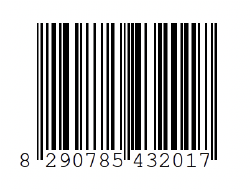

# Definición de códigos

Se puede definir un código, informalmente, como el conjunto de reglas que se usan para representar una información de manera estructurada y procesable. En particular, se refiere a un conjunto de símbolos que se utilizan para representar un mensaje.

En general, un código es una función que transforma un conjunto de datos en otro conjunto, mediante una serie de reglas o algoritmos preestablecidos. Los códigos tienen diversas aplicaciones como la criptografía, la compresión de datos, la corrección de errores, entre otros.

Un ejemplo común de código es el Morse, el cual es utilizado en la comunicación telegráfica. En este código cada letra del alfabeto se representa por una secuencia de puntos y rayas.

Las letras del código Morse se representan:

| Letra | Codigo |
| ----- | ------ |
| A     | .-     |
| B     | -...   |
| C     | -.-.   |
| D     | -..    |
| E     | .      |
| F     | ..-.   |
| G     | --.    |
| H     | ....   |
| I     | ..     |
| J     | .---   |
| K     | -.-    |
| L     | .-..   |
| M     | --     |
| N     | -.     |
| O     | ---    |
| P     | .--.   |
| Q     | --.-   |
| R     | .-.    |
| S     | ...    |
| T     | -      |
| U     | ..-    |
| V     | ...-   |
| W     | .--    |
| X     | -..-   |
| Y     | -.--   |
| Z     | --..   |

Note que en este caso la trasformación se ve como: $c:V→\{−,.\}$ Y que cada $a∈V$, donde V es el vocabulario o alfabeto, se puede representar como una cadena de $−$ y $.$, es decir, $a↦c(a)$, donde $c(a)$ es una cadena de símbolos $−$ y $.$.

La longitud con la que se deben poner las secuencias de rayas y puntos depende de la cantidad de símbolos que se quieran representar. En el ejemplo anterior solo se representaron las letras, pero se pueden poner también números, signos de puntuación y cualquier otro símbolo.

Otro ejemplo es el código binario que se utiliza en la electrónica y la informática para representar información mediante la combinación de los símbolos ``0`` y ``1``.

En este caso la transformación es $c:V→\{0,1\}$

Dentro de los códigos binarios están: el Gray, que es un código donde cada consecutivo difiere en un solo bit; el BCD, que es un código binario que usa cuatro bits para representar cada dígito decimal; el ASCII, que es un código de caracteres utilizado en la informática y la electrónica para representar letras, números y símbolos, este usa 7 bits para representar un total de 128 caracteres diferentes; y el QR, que es un código de barras bidimensional que representa una matriz de puntos que representa la información. Más adelante se verán otros.
## Ejemplos

Algunos ejemplos de cómo se usan los códigos anteriores son:

**Ejemplo** : Escribir la palabra "hola", en codigo Morse.

Recuerde que cada letra representa una codificación de puntos y letras como el vocabulario o lenguaje que se dio en la tabla anterior. Por lo tanto, en código Morse la palabra ``hola" queda:

....−−−.−...−....−−−.−...−

**Ejemplo** : Escribir la palabra "hola", en codigo ASCII.

| Letra | Decimal | Letra | Decimal |
| ----- | ------- | ----- | ------- |
| A     | 65      | a     | 97      |
| B     | 66      | b     | 98      |
| C     | 67      | c     | 99      |
| D     | 68      | d     | 100     |
| E     | 69      | e     | 101     |
| F     | 70      | f     | 102     |
| G     | 71      | g     | 103     |
| H     | 72      | h     | 104     |
| I     | 73      | i     | 105     |
| J     | 74      | j     | 106     |
| K     | 75      | k     | 107     |
| L     | 76      | l     | 108     |
| M     | 77      | m     | 109     |
| N     | 78      | n     | 110     |
| O     | 79      | o     | 111     |
| P     | 80      | p     | 112     |
| Q     | 81      | q     | 113     |
| R     | 82      | r     | 114     |
| S     | 83      | s     | 115     |
| T     | 84      | t     | 116     |
| U     | 85      | u     | 117     |
| V     | 86      | w     | 118     |
| W     | 87      | v     | 119     |
| X     | 88      | x     | 120     |
| Y     | 89      | y     | 121     |
| Z     | 90      | z     | 122     |

En este caso, se deben considerar las mayúsculas y las minúsculas aparte. El código en ASCII, queda: 104 111 108 97

Otros usados son los códigos de barras, los cuales son una forma de codificar información en un patrón de barras y espacios de distintas anchuras. Pueden ser leídos por un lector de códigos de barras, que convierte el patrón en una serie de caracteres que representan la información codificada.

Existen diferentes tipos de códigos de barras, cada uno con su propia estructura y formato de datos. Algunos de los tipos más comunes son:

**EAN-13:** Es un código de barras utilizado, principalmente, en Europa y América del Norte para identificar productos en el comercio minorista. Consiste en 13 dígitos, incluyendo un dígito de control, que se representan en barras de dos anchuras diferentes.

**UPC:** Es un código de barras utilizado, principalmente, en América del Norte para identificar productos en el comercio minorista. Consiste en 12 dígitos, incluyendo un dígito de control, que se representan en barras de dos anchuras diferentes.

**Code 39:** Es un código de barras alfanumérico utilizado para identificar productos, ubicaciones y otros objetos. Consiste en una serie de barras y espacios de dos anchuras diferentes que representan letras, números y algunos símbolos especiales.

**QR Code:** Es un código de barras bidimensional que puede almacenar una gran cantidad de información, incluyendo texto, enlaces web, coordenadas geográficas, información de contacto y más. Consiste en una matriz de puntos negros y blancos, que pueden ser escaneados por un lector de QR para extraer la información.

Los códigos de barras son ampliamente utilizados en el comercio, la logística y la industria para rastrear y gestionar productos, inventarios y envíos. También son utilizados en la emisión de boletos de transporte, en la identificación de pacientes en el ámbito de la salud, etc.

Un ejemplo de un código de barras con EAN-13 se consigue siguiendo los pasos a continuación:

Se comienza con el número que se desea codificar, que debe tener 12 dígitos. Por ejemplo, si desea codificar el número 123456789012, utilice los primeros 12 dígitos:

**123456789012.**

Se calcula el dígito de control. Este se obtiene mediante un cálculo matemático que utiliza los 12 dígitos del número de la siguiente manera:

1. Se suman los dígitos en posición impar $(1,3,5,7,9,11):1+3+5+7+9+2=27$
2. Se multiplica esta suma por 3: $27×3=81$
3. Se suman los dígitos en posición par $(2,4,6,8,10,12):2+4+6+8+0+1=21$
4. Se suma la cifra obtenida en el paso 2 con la cifra obtenida en el paso 3: $81+21=102$
5. El dígito de control se obtiene restando el último dígito de la cifra obtenida en el paso $4$ a 10: $10−2=8$. El dígito de control es $8$.

Se escribe el número completo, incluyendo el dígito de control: 1234567890128.

Se divide el número en grupos de dos dígitos, comenzando desde el extremo derecho. En este caso, los grupos son: 12, 90, 78, 54, 32, 01, y el dígito de control 8.

Se asigna a cada dígito del grupo un patrón de barras y espacios de dos anchuras diferentes. Esto se hace consultando una tabla de conversión que asocia cada dígito con su patrón correspondiente.

Se escribe el patrón completo de barras y espacios, comenzando con un patrón especial que indica el inicio del código, seguido de los patrones de cada grupo de dos dígitos. El patrón completo de EAN-13 tiene 95 barras y espacios en total.

El resultado final será un patrón de barras y espacios que representa el número codificado. Este patrón puede ser impreso en un etiqueta o embebido en un sistema de lectura de códigos de barras.

Se dejan algunos ejercicios para que se practique la codificación, en las próximas secciones se verán otros tipos de codificadores.

# Ejercicios

Los siguientes ejercicios son para la práctica de los estudiantes.
Ejercicios en Archivo...